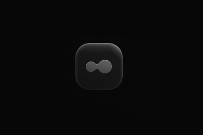
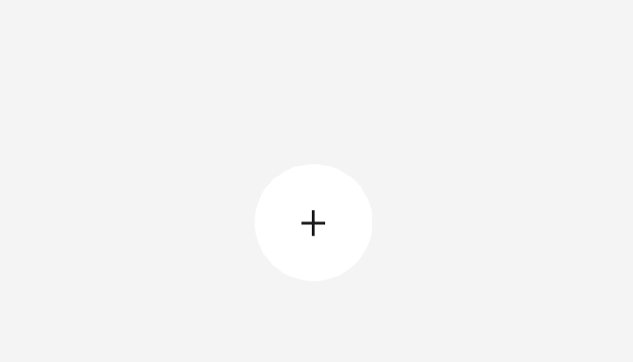
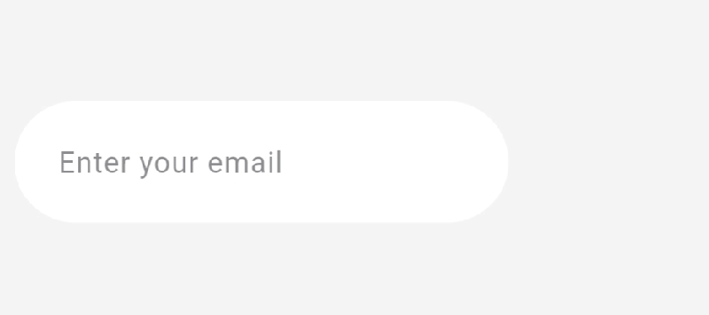
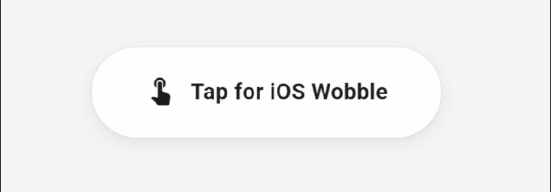
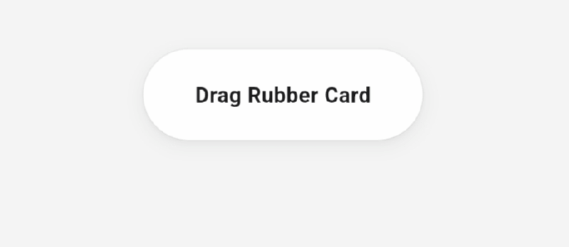
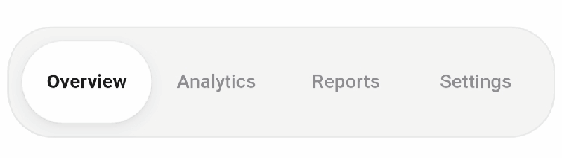
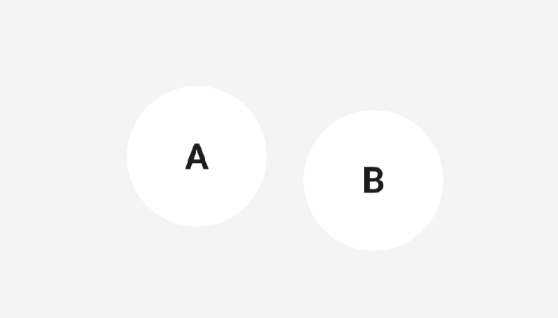

<div align="center">
  
  <h1>Flutter Liquid Gooey</h1>
  <p>120Hz liquid glass and gooey fluid physics framework for Flutter powered by Impeller fragment shaders, 240Hz Euler spring physics, and zero-rebuild vector painters.</p>

  <video src="assets/gifs/full_showcase_flutter_liquid_gooey.mp4" controls width="100%"></video>
  <p><a href="assets/gifs/full_showcase_flutter_liquid_gooey.mp4"><strong>Watch Full Showcase Demo Video</strong></a></p>
</div>

---

## Table of Contents

- [The Story & Inspiration](#the-story--inspiration)
- [Visual Showcase](#visual-showcase)
- [How It Works](#how-it-works)
- [Flutter Strengths & Current Limitations](#flutter-strengths--current-limitations)
- [Key Features](#key-features)
- [Installation](#installation)
- [Cross-Platform Support](#cross-platform-support)
- [Core Components](#core-components)
  - [LiquidParent](#1-liquidparent)
  - [LiquidChild](#2-liquidchild)
  - [LiquidGooeyGroup](#3-liquidgooeygroup)
  - [LiquidItem](#4-liquiditem)
- [API Reference](#api-reference)
- [Practical Recipes & Demonstrations](#practical-recipes--demonstrations)
  - [Recipe A: Expandable Plus Menu](#recipe-a-expandable-plus-menu)
  - [Recipe B: Email Input with Unmerging Send Button](#recipe-b-email-input-with-unmerging-send-button)
  - [Recipe C: Interactive iOS Press Wobble Button](#recipe-c-interactive-ios-press-wobble-button)
  - [Recipe D: Draggable Rubber Card with Velocity Bowing](#recipe-d-draggable-rubber-card-with-velocity-bowing)
  - [Recipe E: Segmented Liquid Tab Bar](#recipe-e-segmented-liquid-tab-bar)
  - [Recipe F: Proximity Avatar Merge](#recipe-f-proximity-avatar-merge)
- [Roadmap & Future Improvements](#roadmap--future-improvements)
- [Contributing](#contributing)
- [Testing & Verification](#testing--verification)

---

## The Story & Inspiration

I built this package by porting the ideas from Jakub Antalik's React web library, [liquid-gooey](https://github.com/Jakubantalik/Libraries/tree/main/packages/liquid-gooey).

Jakub created a beautiful liquid UI concept on the web. On browsers, the gooey effect relies on SVG filters (`feGaussianBlur` and `feColorMatrix`). While visually great, SVG filter rasterization on the DOM often struggles with high CPU load and frame drops during fast drags or complex animations.

Flutter gives us access to native GPU rendering through Impeller and custom GLSL fragment shaders. I wanted to bring this exact aesthetic to Flutter apps with true 120 FPS performance, zero DOM lag, and a developer-friendly API that requires almost no boilerplate.

[Back to Top](#table-of-contents)

---

## Visual Showcase

| Expandable Plus Menu | Email Input Unmerging | Interactive iOS Wobble |
|:---:|:---:|:---:|
|  |  |  |
| **Draggable Rubber Card** | **Segmented Tab Bar** | **Proximity Avatar Merge** |
|  |  |  |

[Back to Top](#table-of-contents)

---

## How It Works

This framework separates the interface into two synchronized layers:

1. **Background Liquid Silhouette (Layer 0):** A custom painter executes an Impeller fragment shader using a Signed Distance Field (SDF) polynomial smooth-min ($s_{\min}$) function. The shader blends overlapping and proximate blobs together. An optional GPU Simplex noise pass adds fluid undulation.
2. **Foreground Interactive Content (Layer 1):** Standard Flutter widgets (text, icons, buttons, fields) render above the liquid silhouette with 100% vector sharpness and full accessibility. The foreground content scales, tilts, and deforms in mathematical harmony with the liquid container.
3. **Physics Engine:** A 240Hz semi-implicit Euler spring simulation calculates mass lead, jelly bounce, and velocity deformations at fixed sub-steps. State changes trigger direct canvas repaints via `ValueNotifier`, keeping the Flutter widget tree from rebuilding during animations.

[Back to Top](#table-of-contents)

---

## Flutter Strengths & Current Limitations

### Where Flutter Shines
- **120Hz Fluid Motion:** Because physics updates run through `ValueNotifier` and `CustomPainter(repaint: notifier)`, the UI achieves locked 120 FPS with zero widget tree rebuilds.
- **Sub-Millisecond Paint Passes:** Paints and uniform buffers are pre-allocated on controller instances. The paint pass executes in under 0.5ms.

### Current Flutter Limitations & How We Solve Them
- **Platform Shader Availability:** Flutter's Impeller backend powers iOS, macOS, and Android natively. On Web (HTML renderer) or older desktop drivers where fragment shaders cannot compile, `LiquidGooeyGroup` automatically falls back to `LiquidVectorGroupPainter`. This fallback draws vector quadratic bezier metaball bridges directly on the canvas so the UI never appears blank.
- **Shader Asset Loading Latency:** Flutter loads `.frag` assets asynchronously from the bundle. On the very first frame before the shader finishes compiling, the vector fallback painter immediately renders the shapes so users see no flicker.
- **Uniform Array Limits in GLSL:** The current fragment shader accepts up to 4 simultaneous dynamic blobs in a single pass. For groups with more than 4 items, the package combines shader blending with vector bridges.

[Back to Top](#table-of-contents)

---

## Key Features

- **Pre-Configured Components:** `LiquidParent` and `LiquidChild` handle instant touch feedback, flight motion blur, and settling wobble automatically.
- **Two-Layer Rendering:** Liquid silhouette on an isolated GPU layer plus crisp interactive foreground widgets.
- **Zero-Rebuild UI Flow:** Physics controllers wire directly to canvas repaints without dirtying widget trees.
- **Impeller SDF Shaders:** Polynomial smooth-min metaball blending with noise undulation.
- **Cross-Platform Fallback:** Automatic vector metaball bridges when GLSL shaders are unavailable.
- **240Hz Euler Springs:** Fixed-step numerical integration with app resume runaway protection.

[Back to Top](#table-of-contents)

---

## Installation

Add `flutter_liquid_gooey` to your `pubspec.yaml`:

```yaml
dependencies:
  flutter_liquid_gooey: ^0.0.1
```

Include the shaders in your `pubspec.yaml`:

```yaml
flutter:
  shaders:
    - packages/flutter_liquid_gooey/shaders/liquid_gooey.frag
    - packages/flutter_liquid_gooey/shaders/image_melt.frag
```

[Back to Top](#table-of-contents)

---

## Cross-Platform Support

| Platform | Rendering Engine | Support Status | Fallback Behavior |
|---|---|---|---|
| **iOS** | Impeller (Metal) | Supported | Native GLSL fragment shaders + 240Hz springs |
| **Android** | Impeller (Vulkan / GLES) | Supported | Native GLSL fragment shaders + 240Hz springs |
| **macOS** | Impeller (Metal) | Supported | Native GLSL fragment shaders + 240Hz springs |
| **Web** | CanvasKit / Skwasm / HTML | Supported | Shaders on CanvasKit; vector bridges on HTML |
| **Windows** | ANGLE / Direct3D / OpenGL | Supported | GPU shaders with automatic vector bridge fallback |
| **Linux** | Impeller (Vulkan) / OpenGL | Supported | GPU shaders with automatic vector bridge fallback |

[Back to Top](#table-of-contents)

---

## Core Components

### 1. `LiquidParent`
Use `LiquidParent` for the primary anchor or trigger element (such as a Plus button, search capsule, or floating action button).

- **Instant Touch Reaction:** Triggers immediate jelly expansion wobble on tap or press.
- **Delayed Merge Absorption:** Triggers impact absorption recoil when children collapse back inside.
- **Crisp Anchoring:** Excludes motion blur so icons and text remain sharp.

```dart
LiquidParent(
  radius: 28.0,
  isExpanded: isExpanded,
  onTap: () {
    setState(() => isExpanded = !isExpanded);
  },
  child: const Icon(Icons.add, color: Color(0xFF1C1C1E)),
)
```

[Back to Top](#table-of-contents)

---

### 2. `LiquidChild`
Use `LiquidChild` for satellite buttons or action items that separate from a parent.

- **Flight Motion Blur:** Applies directional transit blur and unblurs smoothly to a crisp vector upon arrival.
- **Landing Settle Wobble:** Plays a gentle jelly bounce when expansion finishes.
- **Isolated Interaction:** Tapping a child triggers only its own action callback.

```dart
LiquidChild(
  radius: 24.0,
  progress: animationController.value,
  onTap: () => onSelect('document'),
  child: const Text('📄'),
)
```

[Back to Top](#table-of-contents)

---

### 3. `LiquidGooeyGroup`
Wraps the parent and children in a single GPU shader pass to merge their liquid silhouettes smoothly.

```dart
LiquidGooeyGroup(
  fill: const Color(0xFFFFFFFF),
  gooStrength: 36.0,
  child: Stack(
    children: [
      Positioned(
        left: 40.0,
        top: 20.0,
        child: LiquidChild(
          progress: anim.value,
          onTap: () {},
          child: const Text('📄'),
        ),
      ),
      LiquidParent(
        isExpanded: anim.value > 0.05,
        onTap: () => toggle(),
        child: const Text('+'),
      ),
    ],
  ),
)
```

[Back to Top](#table-of-contents)

---

### 4. `LiquidItem`
The low-level liquid widget for custom physics, drag interactions, and fluid deformation effects.

- `LiquidEffect.morph`: Dynamic size and corner radius transitions.
- `LiquidEffect.move`: Chasing satellites and trailing liquid tails.
- `LiquidEffect.bend`: Velocity-dependent vertical and horizontal rubber arc bowing.

```dart
LiquidItem(
  effect: LiquidEffect.bend,
  radius: 26.0,
  position: cardPosition,
  color: const Color(0xFFFFFFFF),
  child: const Text('Drag Rubber Card'),
)
```

[Back to Top](#table-of-contents)

---

## API Reference

| Class | Type | Description |
|---|---|---|
| [`LiquidParent`](lib/src/widgets/liquid_parent.dart) | Widget | Pre-configured parent trigger with instant expansion wobble and delayed merge recoil. |
| [`LiquidChild`](lib/src/widgets/liquid_child.dart) | Widget | Pre-configured child droplet with transit motion blur and arrival settle bounce. |
| [`LiquidGooeyGroup`](lib/src/widgets/liquid_gooey_group.dart) | Widget | Container grouping items into a GPU SDF smooth-min shader pass with vector fallback. |
| [`LiquidItem`](lib/src/widgets/liquid_item.dart) | Widget | Low-level interactive liquid element participating in 240Hz Euler spring physics. |
| [`LiquidContentTransform`](lib/src/widgets/liquid_content_transform.dart) | Widget | Transforms child widgets in locked sync with container velocity tilt and deformation. |
| [`LiquidPhysicsController`](lib/src/physics/liquid_physics_controller.dart) | Physics | ValueNotifier driving simulation state, scale springs, and velocity bend. |
| [`EulerSpringIntegrator`](lib/src/physics/euler_spring_integrator.dart) | Physics | Fixed 240Hz sub-step numerical spring integrator with sleep runaway protection. |
| [`LiquidVectorGroupPainter`](lib/src/rendering/liquid_vector_group_painter.dart) | Painting | Fallback painter drawing vector metaball bridges when GLSL shaders are not loaded. |
| [`LiquidVectorPainter`](lib/src/rendering/liquid_vector_painter.dart) | Painting | Vector painter for individual standalone liquid items. |

[Back to Top](#table-of-contents)

---

## Practical Recipes & Demonstrations

### Recipe A: Expandable Plus Menu

<div align="center">
  
</div>

```dart
import 'dart:math' as math;
import 'package:flutter/widgets.dart';
import 'package:flutter_liquid_gooey/flutter_liquid_gooey.dart';

class MyPlusMenu extends StatefulWidget {
  const MyPlusMenu({super.key});

  @override
  State<MyPlusMenu> createState() => _MyPlusMenuState();
}

class _MyPlusMenuState extends State<MyPlusMenu> with SingleTickerProviderStateMixin {
  late final AnimationController _ctrl;
  late final Animation<double> _spread;

  @override
  void initState() {
    super.initState();
    _ctrl = AnimationController(vsync: this, duration: const Duration(milliseconds: 440));
    _spread = CurvedAnimation(parent: _ctrl, curve: const Cubic(0.34, 1.40, 0.64, 1.0));
  }

  @override
  void dispose() {
    _ctrl.dispose();
    super.dispose();
  }

  void _toggle() {
    _ctrl.isCompleted ? _ctrl.reverse() : _ctrl.forward();
  }

  @override
  Widget build(BuildContext context) {
    return AnimatedBuilder(
      animation: _ctrl,
      builder: (context, _) {
        final t = _spread.value;
        final goo = math.sin(_ctrl.value * math.pi) * 36.0;

        return LiquidGooeyGroup(
          fill: const Color(0xFFFFFFFF),
          gooStrength: goo,
          child: Stack(
            alignment: Alignment.center,
            children: [
              // Satellite 1
              Positioned(
                left: 140.0 - 24.0 - t * 54.0,
                top: 124.0 - 24.0 - t * 40.0,
                child: LiquidChild(
                  progress: _ctrl.value,
                  onTap: () => _ctrl.reverse(),
                  child: const Text('📄'),
                ),
              ),
              // Satellite 2
              Positioned(
                left: 140.0 - 24.0,
                top: 124.0 - 24.0 - t * 62.0,
                child: LiquidChild(
                  progress: _ctrl.value,
                  onTap: () => _ctrl.reverse(),
                  child: const Text('🖼️'),
                ),
              ),
              // Satellite 3
              Positioned(
                left: 140.0 - 24.0 + t * 54.0,
                top: 124.0 - 24.0 - t * 40.0,
                child: LiquidChild(
                  progress: _ctrl.value,
                  onTap: () => _ctrl.reverse(),
                  child: const Text('📁'),
                ),
              ),
              // Parent Trigger
              LiquidParent(
                isExpanded: _ctrl.value > 0.05,
                onTap: _toggle,
                child: SizedBox(
                  width: 56.0,
                  height: 56.0,
                  child: Center(
                    child: Transform.rotate(
                      angle: t * (math.pi / 4.0),
                      child: const Text('+', style: TextStyle(fontSize: 26.0)),
                    ),
                  ),
                ),
              ),
            ],
          ),
        );
      },
    );
  }
}
```

[Back to Top](#table-of-contents)

---

### Recipe B: Email Input with Unmerging Send Button

<div align="center">
  
</div>

```dart
import 'dart:math' as math;
import 'package:flutter/material.dart';
import 'package:flutter_liquid_gooey/flutter_liquid_gooey.dart';

class MyEmailInput extends StatefulWidget {
  const MyEmailInput({super.key});

  @override
  State<MyEmailInput> createState() => _MyEmailInputState();
}

class _MyEmailInputState extends State<MyEmailInput> with SingleTickerProviderStateMixin {
  final TextEditingController _textCtrl = TextEditingController();
  final FocusNode _focusNode = FocusNode();
  late final AnimationController _ctrl;
  late final Animation<double> _slide;

  @override
  void initState() {
    super.initState();
    _ctrl = AnimationController(vsync: this, duration: const Duration(milliseconds: 460));
    _slide = CurvedAnimation(parent: _ctrl, curve: const Cubic(0.34, 1.4, 0.64, 1.0));
    _focusNode.addListener(() {
      _focusNode.hasFocus ? _ctrl.forward() : _ctrl.reverse();
    });
  }

  @override
  void dispose() {
    _textCtrl.dispose();
    _focusNode.dispose();
    _ctrl.dispose();
    super.dispose();
  }

  @override
  Widget build(BuildContext context) {
    return AnimatedBuilder(
      animation: _ctrl,
      builder: (context, _) {
        final goo = math.sin(_ctrl.value * math.pi) * 44.0;
        final buttonLeft = 174.0 + _slide.value * 72.0;

        return LiquidGooeyGroup(
          fill: const Color(0xFFFFFFFF),
          gooStrength: goo,
          child: Stack(
            alignment: Alignment.centerLeft,
            children: [
              Positioned(
                left: buttonLeft,
                top: 4.0,
                child: LiquidChild(
                  radius: 28.0,
                  progress: _ctrl.value,
                  onTap: () {
                    _focusNode.unfocus();
                    _textCtrl.clear();
                    _ctrl.reverse();
                  },
                  child: const SizedBox(
                    width: 56.0,
                    height: 56.0,
                    child: Center(child: Text('→', style: TextStyle(fontSize: 20.0))),
                  ),
                ),
              ),
              LiquidParent(
                radius: 28.0,
                isExpanded: _ctrl.value > 0.05,
                child: Container(
                  width: 230.0,
                  height: 56.0,
                  padding: const EdgeInsets.symmetric(horizontal: 20.0),
                  child: TextField(
                    controller: _textCtrl,
                    focusNode: _focusNode,
                    decoration: const InputDecoration(
                      hintText: 'Enter your email',
                      border: InputBorder.none,
                    ),
                  ),
                ),
              ),
            ],
          ),
        );
      },
    );
  }
}
```

[Back to Top](#table-of-contents)

---

### Recipe C: Interactive iOS Press Wobble Button

<div align="center">
  
</div>

```dart
import 'package:flutter/widgets.dart';
import 'package:flutter_liquid_gooey/flutter_liquid_gooey.dart';

class MyIosButton extends StatelessWidget {
  const MyIosButton({super.key});

  @override
  Widget build(BuildContext context) {
    return LiquidItem(
      radius: 26.0,
      color: const Color(0xFFFFFFFF),
      child: Container(
        width: 180.0,
        height: 52.0,
        alignment: Alignment.center,
        child: const Text(
          'Tap for iOS Wobble',
          style: TextStyle(
            color: Color(0xFF1C1C1E),
            fontWeight: FontWeight.w600,
            fontSize: 14.0,
          ),
        ),
      ),
    );
  }
}
```

[Back to Top](#table-of-contents)

---

### Recipe D: Draggable Rubber Card with Velocity Bowing

<div align="center">
  
</div>

```dart
import 'package:flutter/widgets.dart';
import 'package:flutter_liquid_gooey/flutter_liquid_gooey.dart';

class MyRubberCard extends StatefulWidget {
  const MyRubberCard({super.key});

  @override
  State<MyRubberCard> createState() => _MyRubberCardState();
}

class _MyRubberCardState extends State<MyRubberCard> {
  Offset _pos = const Offset(80.0, 40.0);

  @override
  Widget build(BuildContext context) {
    return GestureDetector(
      onPanUpdate: (details) {
        setState(() => _pos += details.delta);
      },
      child: LiquidItem(
        effect: LiquidEffect.bend,
        radius: 999.0,
        position: _pos,
        color: const Color(0xFFFFFFFF),
        child: Container(
          width: 160.0,
          height: 52.0,
          alignment: Alignment.center,
          child: const Text(
            'Drag Rubber Card',
            style: TextStyle(
              color: Color(0xFF1C1C1E),
              fontWeight: FontWeight.w700,
              fontSize: 13.5,
            ),
          ),
        ),
      ),
    );
  }
}
```

[Back to Top](#table-of-contents)

---

### Recipe E: Segmented Liquid Tab Bar

<div align="center">
  
</div>

```dart
import 'package:flutter/widgets.dart';
import 'package:flutter_liquid_gooey/flutter_liquid_gooey.dart';

class MyLiquidTabBar extends StatelessWidget {
  final Offset indicatorOffset;
  final double tabWidth;

  const MyLiquidTabBar({
    super.key,
    required this.indicatorOffset,
    required this.tabWidth,
  });

  @override
  Widget build(BuildContext context) {
    return LiquidItem(
      effect: LiquidEffect.move,
      radius: 20.0,
      position: indicatorOffset,
      color: const Color(0xFFFFFFFF),
      child: SizedBox(
        width: tabWidth,
        height: 40.0,
      ),
    );
  }
}
```

[Back to Top](#table-of-contents)

---

### Recipe F: Proximity Avatar Merge

<div align="center">
  
</div>

```dart
import 'package:flutter/widgets.dart';
import 'package:flutter_liquid_gooey/flutter_liquid_gooey.dart';

class MyAvatarMergeGroup extends StatelessWidget {
  final Offset avatarOffset;

  const MyAvatarMergeGroup({super.key, required this.avatarOffset});

  @override
  Widget build(BuildContext context) {
    return LiquidGooeyGroup(
      fill: const Color(0xFFFFFFFF),
      gooStrength: 42.0,
      child: Stack(
        children: [
          const Positioned(
            left: 40.0,
            top: 40.0,
            child: LiquidItem(
              radius: 30.0,
              child: SizedBox(width: 60.0, height: 60.0),
            ),
          ),
          Positioned(
            left: avatarOffset.dx,
            top: avatarOffset.dy,
            child: const LiquidItem(
              radius: 30.0,
              child: SizedBox(width: 60.0, height: 60.0),
            ),
          ),
        ],
      ),
    );
  }
}
```

[Back to Top](#table-of-contents)

---

## Roadmap & Future Improvements

We welcome developers to work on open improvement areas:

1. **Multi-Texture Image Melt at Arbitrary Angles:** The current `image_melt.frag` handles horizontal contact seams. Extending noise marbling across arbitrary polygonal boundaries will unlock complex image blending.
2. **Dynamic Specular Point-Light Highlights:** Adding pointer tilt or device accelerometer inputs to drive real-time specular highlights across liquid surfaces.
3. **Spatial Clustering for Unlimited Shader Blobs:** Expanding beyond 4 simultaneous shader blobs by grouping elements dynamically into local spatial clusters.
4. **Haptic Feedback Integrations:** Adding light haptic pulses during droplet separation and merge impacts.

[Back to Top](#table-of-contents)

---

## Contributing

Contributions are very welcome. Whether fixing a bug, improving documentation, adding an example, or optimizing shaders, your help makes this package better for the entire Flutter community.

### Contribution Steps
1. Fork the repository on GitHub.
2. Clone your fork locally:
   ```bash
   git clone https://github.com/your-username/flutter_liquid_gooey.git
   ```
3. Create a descriptive feature branch:
   ```bash
   git checkout -b feature/my-new-effect
   ```
4. Follow project standards:
   - Keep files under 150 lines.
   - Use 1 class per file.
   - Use absolute package imports (`import 'package:flutter_liquid_gooey/...';`).
   - Write tests for any new physics or rendering logic.
5. Verify code quality:
   ```bash
   dart analyze packages/flutter_liquid_gooey example
   cd packages/flutter_liquid_gooey && flutter test
   ```
6. Open a Pull Request with a clear description and screen recording if modifying visuals.

[Back to Top](#table-of-contents)

---

## Testing & Verification

Run tests and analysis:

```bash
cd packages/flutter_liquid_gooey
flutter test
dart analyze
```

[Back to Top](#table-of-contents)
